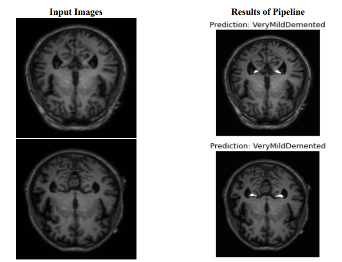

# Alzheimer's Disease Classification and Segmentation in MRI using CNN and U-Net

(Derin Evrişimli Sinir Ağlarını Kullanarak MRG Modalitesinde Alzheimer Hastalığının Sınıflandırılması ve Segmentasyonu)

In the study, classification and segmentation tasks were implemented for analysis of Alzheimer's disease. In classification task, 7
different models were tested using transfer learning. The GoogLeNet model achieved the best classification performance with the
accuracy of 0.9467, sensitivity of 0.9474, specificity of 0.9811, and F1-score of 0.9467. In segmentation task, U-Net architecture design
was used for the segmentation of Alzheimer's disease. U-Net model achieved the dice of 0.874, IoU of 0.776, sensitivity of 0.868,
specificity of 0.999, precision of 0.879, and accuracy of 0.999. In order to create the pipeline, classification and segmentation models
were used together. Consequently, a computer vision-assisted decision support system was created.

# Output

