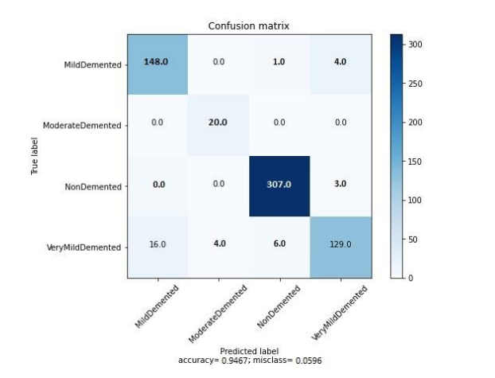
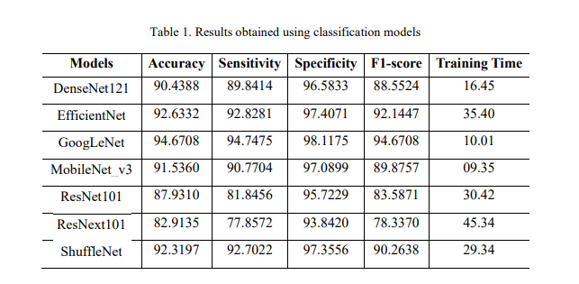
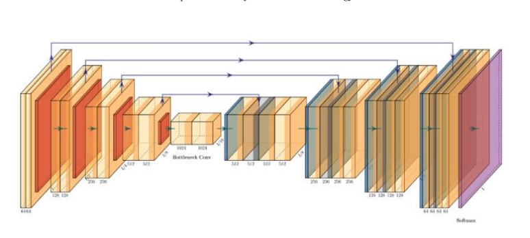

# 🧠 Alzheimer's Disease Classification and Segmentation in MRI
### CNN-based Diagnosis Pipeline with GoogLeNet and U-Net

*(Derin Evrişimli Sinir Ağlarını Kullanarak MRG Modalitesinde Alzheimer Hastalığının Sınıflandırılması ve Segmentasyonu)*

---

## 📑 Table of Contents

- [Overview](#-overview)
- [Motivation](#-motivation)
- [Proposed Pipeline](#-proposed-pipeline)
- [Classification Module](#-classification-module)
- [Segmentation Module](#-segmentation-module)
- [Qualitative Results](#-qualitative-results)
- [Datasets](#-datasets)
- [Training Details](#-training-details)
- [Evaluation Metrics](#-evaluation-metrics)
- [Key Contributions](#-key-contributions)
- [Conclusion](#-conclusion)
- [Citation](#-citation)
- [Acknowledgment](#-acknowledgment)
- [Contact](#-contact)

---

## 📌 Overview

This repository presents a **computer vision–assisted decision support system** for **Alzheimer’s disease diagnosis** using **MRI data**.  
The proposed framework integrates **deep learning–based classification and segmentation** into a **single end-to-end pipeline**.

The study is based on a **peer-reviewed journal article** and focuses on:

- **Multi-class Alzheimer’s disease classification** using transfer learning  
- **Precise anatomical segmentation** of hippocampus regions  
- **Pipeline-level integration** of classification and segmentation models  
- Quantitative evaluation using **clinically relevant metrics**

> 📄 **Journal Reference**  
> *European Journal of Science and Technology, Special Issue 40, 2022*  
> **DOI:** 10.31590/ejosat.1171810

---

## 🎯 Motivation

Alzheimer’s disease is a progressive neurodegenerative disorder where **early diagnosis is critical**.  
Although MRI provides rich structural information, **manual interpretation is time-consuming, subjective, and operator-dependent**.

This project aims to:

- Assist radiologists with **automated decision support**
- Combine **global disease classification** with **local anatomical segmentation**
- Provide a **robust, interpretable, and reproducible AI pipeline** for clinical research

---

## 🧩 Proposed Pipeline

The system follows a **two-stage pipeline architecture**:

1. **Classification Stage**  
   → Determines Alzheimer’s disease stage from MRI images  

2. **Segmentation Stage**  
   → Segments hippocampus regions for anatomical validation  

### 🔁 Pipeline Flow

MRI Image  
↓  
CNN-based Classification (GoogLeNet)  
↓  
U-Net Segmentation  
↓  
Decision Support Output  

---

## 🧠 Classification Module

### ✔ Models Evaluated

Seven CNN architectures were evaluated using **transfer learning (ImageNet pretrained)**:

- DenseNet121  
- EfficientNet  
- **GoogLeNet (Best Performer)**  
- MobileNetV3  
- ResNet101  
- ResNeXt101  
- ShuffleNet  

### 🏆 Best Classification Performance

**GoogLeNet** achieved the best overall performance:

| Metric        | Value |
|--------------|-------|
| Accuracy     | **0.9467** |
| Sensitivity  | 0.9474 |
| Specificity  | 0.9811 |
| F1-score     | 0.9467 |

📊 **Confusion Matrix**

📋 **Model Comparison Summary**

---

## 🧬 Segmentation Module

### ✔ Architecture

For anatomical segmentation, a **U-Net** architecture was used to segment:

- **Left hippocampus**
- **Right hippocampus**

📐 **U-Net Architecture**

### 📈 Segmentation Performance

| Metric        | Value |
|--------------|-------|
| Dice Score   | **0.874** |
| IoU          | 0.776 |
| Sensitivity  | 0.868 |
| Specificity  | 0.999 |
| Precision    | 0.879 |
| Accuracy     | 0.999 |

---

## 🖼️ Qualitative Results

Below is a visualization of the **complete pipeline output**, including:

- Input MRI images  
- Disease stage classification  
- Hippocampus segmentation masks  
- Combined pipeline inference  

---

## 📊 Datasets

### 🧠 Classification Dataset
- **Source:** Kaggle – Alzheimer’s Dataset (4-Class)
- **Classes:**  
  - Non Demented  
  - Very Mild Demented  
  - Mild Demented  
  - Moderate Demented  
- **Total Images:** 7,093  
- **Train/Test Split:** 90% / 10%

### 🧬 Segmentation Dataset
- **Source:** ADNI (Alzheimer’s Disease Neuroimaging Initiative)
- **Annotations:** Hippocampus regions
- **Image Format:** DICOM → PNG
- **Resolution:** 128×128

---

## ⚙️ Training Details

### Classification
- Framework: **PyTorch**
- Optimizer: Adam  
- Loss Function: Cross Entropy  
- Epochs: 20  
- Batch Size: 16  
- Hardware: NVIDIA Tesla T4  

### Segmentation
- Framework: **PyTorch**
- Optimizer: RMSprop  
- Loss Function: Dice + Cross Entropy  
- Epochs: 50  
- Batch Size: 2  
- Hardware: NVIDIA RTX 3060  

---

## 📐 Evaluation Metrics

The following metrics were used to ensure **clinical relevance and robustness**:

- Accuracy  
- Sensitivity (Recall)  
- Specificity  
- Precision  
- F1-score  
- Dice Coefficient  
- Intersection over Union (IoU)

---

## 🧪 Key Contributions

✔ Integrated **classification and segmentation** in a unified pipeline  
✔ Extensive CNN architecture benchmarking  
✔ High-performance GoogLeNet-based diagnosis  
✔ Clinically interpretable hippocampus segmentation  
✔ Vision-assisted **CAD decision support system**

---

## 🔬 Conclusion

This study demonstrates that combining **deep CNN-based classification** with **anatomical segmentation** significantly improves the reliability of Alzheimer’s disease analysis from MRI data.

The proposed pipeline:

- Reduces radiologist workload  
- Improves diagnostic confidence  
- Enables early-stage disease detection  

---

## 📚 Citation

If you use this work, please cite:

Karakaya, F., Gurkan, C., Budak, A., & Karatas, H. (2022).  
Classification and Segmentation of Alzheimer Disease in MRI Modality using Deep CNNs.  
European Journal of Science and Technology, (40), 99–105.  
DOI: 10.31590/ejosat.1171810  

---

## 🤝 Acknowledgment

This work was supported by **AKGÜN Computer Inc.**  
Special thanks for providing computational resources and research support.

---

## 📬 Contact

**Furkan Karakaya**  
📧 se.furkankarakaya@gmail.com  

---

⭐ If you find this project useful, feel free to star the repository!
